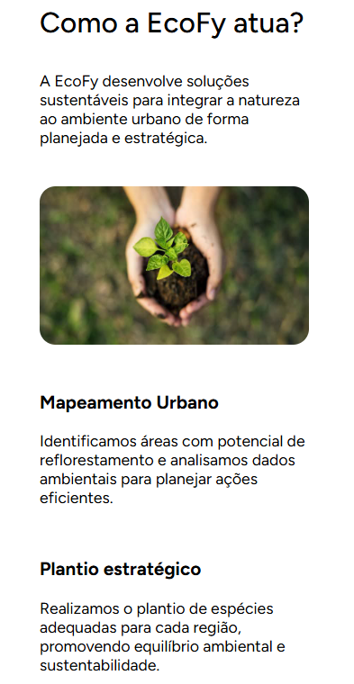
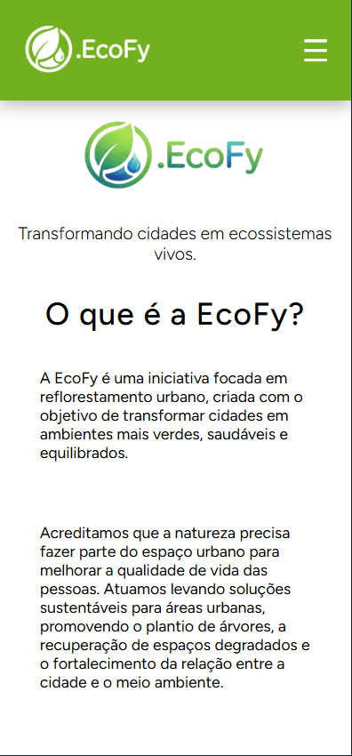

# EcoFy - Landing Page

🌿 Uma landing page institucional fictícia focada em reflorestamento urbano.

## 🌿 Sobre o projeto

A EcoFy é uma landing page institucional fictícia desenvolvida com o objetivo de apresentar uma iniciativa voltada ao reflorestamento urbano e à construção de cidades mais sustentáveis.

O projeto foi pensado para simular uma aplicação real, com foco em organização de conteúdo, hierarquia visual e experiência do usuário, utilizando uma abordagem mobile-first.

A proposta da EcoFy é demonstrar como soluções digitais podem ser utilizadas para comunicar ideias ambientais de forma clara, moderna e acessível.

## 🚀 Tecnologias
- HTML5
- CSS3
- JavaScript

## 📱 Responsividade
Projeto desenvolvido com abordagem mobile-first.

## 🔗 Acesse o projeto
Repositório: https://github.com/KAYCAO11/EcoFy---Landing-Page

## 📸 Preview

